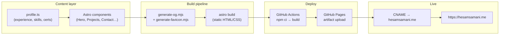
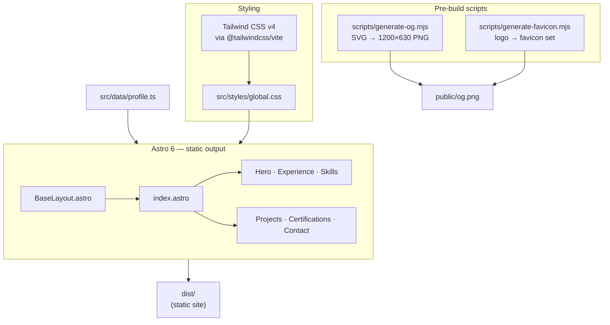

<div align="center">

# hesamsamani.me

### Professional portfolio — BIM specialist & AI tool builder

**Healthcare & commercial BIM delivery · ISO 19650 · LOD 350–400 · open-source desktop tools**

<br />

[](https://hesamsamani.me)
[](https://astro.build/)
[](https://tailwindcss.com/)
[](https://www.typescriptlang.org/)
[](https://pages.github.com/)

[What is this?](#what-is-this) · [How it works](#how-it-works) · [Architecture](#architecture) · [Quick start](#quick-start) · [Projects site](https://hesamsamani.codes)

</div>

---

## What is this?

**hesamsamani.me** is the professional portfolio site for **Hesam Samani** — a BIM specialist based in Hasselt, Belgium, who also builds privacy-first AI desktop tools.

The site presents:

| Section | Content |
| --- | --- |
| **Hero & intro** | Role tags, relocation note, key stats (4+ years BIM, ACP certs, 50+ students taught) |
| **Experience** | Healthcare & academic BIM roles with discipline tags and deliverable bullets |
| **Skills** | Revit (Arch / Structure / MEP), Navisworks, Solibri, Python, AI tooling |
| **Certifications** | Autodesk Certified Professional credentials + university programs |
| **Projects** | Featured open-source tools with links to GitHub and [hesamsamani.codes](https://hesamsamani.codes) |
| **Contact** | LinkedIn, GitHub, projects site, and professional channels |

All copy and structured data live in TypeScript (`src/data/profile.ts`) — no CMS, no database, no runtime API.

---

## How it works



1. Edit **`src/data/profile.ts`** or component markup under **`src/components/`**.
2. Run **`npm run build`** — OG image and favicon are regenerated, then Astro emits static files to **`dist/`**.
3. Push to **`main`** — the deploy workflow builds, audits dependencies, and publishes to GitHub Pages.
4. **Custom domain** (`public/CNAME`) serves the site at **hesamsamani.me**.

---

## Architecture



| Layer | Choice |
| --- | --- |
| Framework | [Astro 6](https://astro.build/) — zero JS by default, component islands as needed |
| Styling | Tailwind CSS v4 with Vite plugin |
| Data | TypeScript modules (`profile.ts`) — type-safe, version-controlled content |
| Assets | `sharp`-powered OG + favicon generation at build time |
| Hosting | GitHub Pages (Actions deploy, `.nojekyll`, verified `dist/` artifacts) |
| Domain | `hesamsamani.me` via `public/CNAME` |

---

## Features

- **Single-page professional narrative** — scannable sections for recruiters and BIM hiring managers
- **Structured BIM credentials** — ISO 19650, LOD 350–400, multidisciplinary Revit experience
- **Project cross-links** — bridges to GitHub repos and the developer portfolio at hesamsamani.codes
- **SEO-ready** — generated Open Graph image, favicon set, and static meta in layout
- **Fast & private** — fully static; no analytics SDK, no server, no user data collection
- **CI-gated deploy** — high-severity `npm audit` check before every Pages publish

---

## Tech stack

| Area | Technology |
| --- | --- |
| Site generator | Astro 6 (`output: 'static'`) |
| Language | TypeScript 5 |
| CSS | Tailwind CSS v4 |
| Image tooling | sharp (OG PNG, favicon pipeline) |
| CI/CD | GitHub Actions → GitHub Pages |
| Node | 22 (workflow + local dev) |

---

## Quick start

```bash
git clone https://github.com/Hesamsamani/Hesamsamani.github.io.git
cd Hesamsamani.github.io
npm install
npm run dev      # http://localhost:4321
npm run build    # regenerate OG/favicon + dist/
npm run preview  # preview production build
```

### Project structure

```text
/
├── public/              # CNAME, og.svg, images, static assets
├── scripts/
│   ├── generate-og.mjs      # Build-time OG PNG
│   └── generate-favicon.mjs # Favicon + touch icons
├── src/
│   ├── components/      # Hero, Nav, Experience, Projects, Contact…
│   ├── data/
│   │   └── profile.ts   # All portfolio content (edit here)
│   ├── layouts/
│   │   └── BaseLayout.astro
│   ├── pages/
│   │   └── index.astro
│   └── styles/
│       └── global.css
├── .github/workflows/
│   └── deploy.yml       # Build + GitHub Pages deploy
└── astro.config.mjs     # site: https://hesamsamani.me
```

---

## Related

| Resource | URL |
| --- | --- |
| Live portfolio | [hesamsamani.me](https://hesamsamani.me) |
| Developer projects | [hesamsamani.codes](https://hesamsamani.codes) |
| GitHub profile | [github.com/Hesamsamani](https://github.com/Hesamsamani) |
| LinkedIn | [linkedin.com/in/hesam-samani](https://www.linkedin.com/in/hesam-samani/) |

---

<sub>Built and maintained by **Hesam Samani** · BIM Specialist · Hasselt, Belgium</sub>